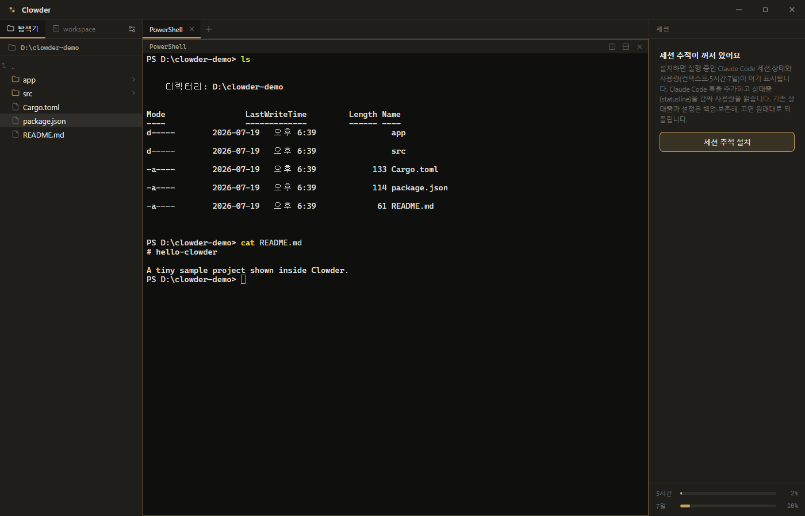

<div align="center">

# Clowder

**여러 Claude Code 세션을 한 화면에서 다루는 터미널 워크스페이스**
*A terminal workspace for running parallel Claude Code sessions on one screen*

**[Microsoft Store에서 설치 · Install from the Microsoft Store ↗](https://apps.microsoft.com/detail/9N4795KFCRC3)**

Windows · 오프라인 / 로컬 전용 · [MIT](LICENSE)



</div>

## 왜

VS Code가 대부분을 덮지만 두 가지가 막힌다: **탐색기가 연 폴더(workspace)에 종속**돼 전체 파일시스템을 자유롭게 뒤질 수 없고, 세션·서브에이전트 트리를 붙일 수 없다. Windows Terminal의 pane은 터미널만 담는다.

Clowder는 **여러 Claude Code 세션을 병렬로** 돌리며 — 터미널에서 git·빌드를 하고, 산출물을 문서 뷰어로 확인하고, 전체 파일을 탐색하는 걸 **정돈된 한 창**에 모은다. 그리고 실행 중인 세션의 상태·사용량을 우측 레일에 상시 보여준다.

## 주요 기능

- **탭 + 타일링 터미널** — 폴더에서 바로 터미널 열기, 페인 분할, PowerShell / bash. 터미널은 keep-alive 풀이라 탭을 오가도 살아있다. 사이드로드한 ConPTY로 한글이 깨지지 않는다.
- **전체 파일 탐색기** — 연 폴더에 종속되지 않는다. 단일 폴더 네비게이터(`..` 상위 이동) + 활성 터미널 cwd 기준 workspace 트리.
- **우측 레일 = 고르는 패널 호스트** — 헤더 스위처로 필요한 것만 띄운다. 안 쓰는 도구의 패널은 스스로 숨는다.
  - **세션**(선택 설치) — 실행 중인 Claude Code 세션 상태(승인 대기 · 대기 중 · 동작 중 · 유휴), 서브에이전트, 컨텍스트·5시간/7일 사용량.
  - **포트** — 열린 포트와 소유 프로세스, 클릭 한 번으로 종료("3000 포트가 이미 사용 중" 해결). 시스템 포트는 기본 숨김.
  - **Git** — 활성 터미널 폴더의 브랜치·변경 상태. `cd`를 따라간다.
  - **SSH** — `~/.ssh/config`의 호스트를 클릭하면 접속 터미널이 열린다.
  - **Docker · 쿠버네티스** — 컨테이너 시작/정지·exec·로그, 컨텍스트/네임스페이스 전환·파드 exec·로그.
  - **작업 · 스니펫** — 폴더의 npm / Make / just 스크립트 실행, 자주 쓰는 명령 저장·재실행.
- **터미널 클립보드** — `Ctrl+V` 붙여넣기, 선택이 있을 때만 복사하는 `Ctrl+C`, Shift+드래그 부분 선택. **전체화면 TUI에서도 복사가 된다** — 프로그램의 클립보드 요청(OSC 52)을 처리하므로 Claude Code·tmux·vim의 복사가 그대로 클립보드로 온다.
- **문서 뷰어** — 로컬 Markdown / HTML(수식·다이어그램 포함) 렌더링. 탭을 다녀와도 읽던 자리를 유지한다.
- **디자인** — 딥다크 / 라이트 테마 + 액센트, 커스텀 제목표시줄. 터미널 색 테마는 앱 테마와 별개 축이다.
- **언어** — 한국어 · 영어 UI. 기본은 시스템 언어를 따르고, 설정에서 바로 바꿀 수 있다(재시작 없음).

## 시작하기

1. **[Microsoft Store](https://apps.microsoft.com/detail/9N4795KFCRC3)에서 설치**(권장, 자동 업데이트), 또는 [Releases](https://github.com/slnu21/Clowder/releases)에서 `Clowder_*_x64-setup.exe`(NSIS) · `Clowder_*_x64_en-US.msi`를 받는다.
2. **요구사항**: Windows 10 / 11 (x64), WebView2 런타임(Windows 11 내장).
3. **오프라인 / 로컬 전용** — 네트워크 전송·원격 서버 없음. 설정은 `%APPDATA%\deck`, 세션 추적 스풀(설치 시)은 `%LOCALAPPDATA%\Clowder`에 로컬 저장. 자세히는 [PRIVACY.md](PRIVACY.md).

> 세션 추적은 첫 실행 시 강제되지 않는다. 우측 레일 버튼으로 설치하면 Claude Code 훅이 안전하게 추가되고(설정 백업), "세션 추적 끄기"로 원래대로 복원된다.

## 개발

Tauri v2 (Rust 셸) + React + TypeScript + Vite. 프론트엔드 소스는 Tauri 기본 `src/`가 아니라 **`src/app/`**에 있다.

```bash
cd src
npm install            # 최초 1회
npm run tauri dev      # 개발 실행
npm run tauri build    # 릴리스 빌드 (MSI / NSIS)
```

MSIX 패키징(Microsoft Store)은 [packaging/README.md](packaging/README.md) 참고.

## 라이선스

[MIT](LICENSE) © 2026 slnu21 — 상업적 사용·재배포 허용. 최종 사용자 약관은 [EULA.md](EULA.md), 번들·의존 구성요소 고지는 [THIRD-PARTY-NOTICES.md](THIRD-PARTY-NOTICES.md).

---

<div align="center">

## English

</div>

## Why

VS Code covers most of it, but two things are blocked: **its explorer is tied to the open workspace folder** (you can't freely browse the whole filesystem), and you can't attach a session / subagent tree. Windows Terminal panes only hold terminals.

Clowder runs **multiple Claude Code sessions in parallel** — do git and builds in the terminals, check the output in a document viewer, and browse the whole filesystem, all in **one organized window** — with a live rail showing each session's status and usage.

## Features

- **Tabbed + tiling terminals** — open a terminal straight from a folder, split panes, PowerShell / bash. Terminals live in a keep-alive pool, surviving tab switches. A sideloaded ConPTY keeps CJK output intact.
- **Full file explorer** — not bound to the open folder: a single-folder navigator (with `..` up-navigation) plus a workspace tree scoped to the active terminal's cwd.
- **The right rail is a panel host you choose from** — pick what you need with the header switcher; panels for tools you don't have hide themselves.
  - **Sessions** (optional) — live Claude Code session status (awaiting permission · waiting · working · idle), subagents, and context / 5h / 7d usage.
  - **Ports** — listening ports with their owning process, killable in one click (fixes "port 3000 already in use"). System ports hidden by default.
  - **Git** — the active terminal folder's branch and changes; follows along as you `cd`.
  - **SSH** — click a host from `~/.ssh/config` to open a connected terminal.
  - **Docker · Kubernetes** — start/stop containers, exec, logs; switch context/namespace, exec into pods, tail logs.
  - **Tasks · Snippets** — run a folder's npm / Make / just scripts; save commands you run often and re-run them.
- **Terminal clipboard** — `Ctrl+V` pastes, `Ctrl+C` copies only when there's a selection, Shift+drag makes a partial selection. **Copy works in a fullscreen TUI too** — the terminal handles a program's clipboard request (OSC 52), so copying in Claude Code, tmux, or vim lands on your clipboard.
- **Document viewer** — renders local Markdown / HTML with math and diagrams, and holds your reading position across tab switches.
- **Design** — deep-dark / light themes with an accent, and a custom title bar. The terminal palette is its own axis, separate from the app theme.
- **Language** — Korean and English UI. It follows your system language by default and switches instantly in settings, with no restart.

## Getting started

1. **Install from the [Microsoft Store](https://apps.microsoft.com/detail/9N4795KFCRC3)** (recommended, auto-updates), or grab an installer from [Releases](https://github.com/slnu21/Clowder/releases): `Clowder_*_x64-setup.exe` (NSIS) or `Clowder_*_x64_en-US.msi`.
2. **Requirements**: Windows 10 / 11 (x64), WebView2 runtime (built into Windows 11).
3. **Offline & local-only** — no network transmission, no remote servers. Settings live in `%APPDATA%\deck`; the session-tracking spool (if installed) in `%LOCALAPPDATA%\Clowder`. See [PRIVACY.md](PRIVACY.md).

> Session tracking is never forced on first run. Install it from the rail button — Claude Code hooks are added safely (settings backed up), and "turn off session tracking" restores everything.

## Development

Tauri v2 (Rust shell) + React + TypeScript + Vite. The frontend source lives in **`src/app/`**, not Tauri's default `src/`.

```bash
cd src
npm install            # first time
npm run tauri dev      # run in dev
npm run tauri build    # release build (MSI / NSIS)
```

For MSIX packaging (Microsoft Store), see [packaging/README.md](packaging/README.md).

## License

[MIT](LICENSE) © 2026 slnu21 — commercial use and redistribution permitted. End-user terms in [EULA.md](EULA.md); bundled / dependency notices in [THIRD-PARTY-NOTICES.md](THIRD-PARTY-NOTICES.md).
